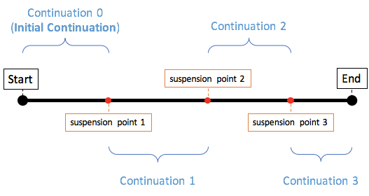

# 协程原理

## 挂起函数的工作原理

协程的内部实现使用了Kotlin编译器的一些编译技术，当挂起函数调用时，背后大致细节如下：

挂起函数或者挂起lambda表达式调用，都有一个隐式的参数额外传入，这个参数是Continution类型，封装了协程恢复后的执行代码逻辑。

```kotlin
suspend fun requestToken(): Token {...}
```

实际上

```koltin
Object requestToken(Continuation<Token> cont) {...}
```

Continuation定义如下，类似一个通用回调接口：

```kotlin
/**
 * Interface representing a continuation after a suspension point that returns value of type `T`.
 */
public interface Continuation<in T> {
    /**
     * Context of the coroutine that corresponds to this continuation.
     */
    public val context: CoroutineContext
    /**
     * Resumes the execution of the corresponding coroutine passing successful or failed [result] as the
     * return value of the last suspension point.
     */
    public fun resumeWith(result: Result<T>)
}
```

示例：

```kotlin
suspend fun requestToken(): Token {...}

suspend fun createPost(token: Token, item: Item): Post {...}

fun processPost(post: Post) {...}

fun postItem(item: Item) {
    GlobalScope.launch {
        val token = requestToken()
        val post = createPost(token, item)
        processPost(post)
    }
}
```

协程内部实现不是使用普通回调的形式，而是使用状态机来处理不同的挂起点，大致GPS

```kotlin
// 编译后生成的内部类大致如下
final class postItem$1 extends SuspendLambda ... {
    public final Object invokeSuspend(Object result) {
        ...
        switch (this.label) {
            case 0:
                this.label = 1;
                token = requestToken(this)
                break;
            case 1:
                this.label = 2;
                Token token = result;
                post = createPost(token, this.item, this)
                break;
            case 2:
                Post post = result;
                processPost(post)
                break;
        }
    }
}
```

每一个挂起点和初始挂起点对应的Continuation都会转化为一种状态，协程恢复只是跳转下一种状态中。挂起函数将执行过程分为多个多个Continuation片段，并且利用状态机的方式保证各个片段是顺序执行的


### 挂起函数可能会挂起协程

多个协程的情况下，挂起函数的作用：

```kotlin
fun postItem(item: Item) {
    GlobalScope.launch {
        // async新建一个协程，可能在另一个线程运行
        //但是 await() 是挂起函数，当前协程执行逻辑卡在第一个分支，第一种状态，当 async 的协程执行完后恢复当前协程，才会切换到下一个分支
        vol token = async { requestToken() }.await()
        //在第二个分支状态中，又新建一个协程，
        //使用await挂起函数将之后代码作为Continuation放到下一个分支状态，直到async协程执行完成
        val post = async { createPost(token, item)}.await()
        //最后一个分支状态，直接在当前协程处理
        processPost(post)
    }
}
```

`await()`挂起函数挂起当前协程，直到异步协程完成执行，但是这里并没有阻塞线程，是使用状态机的控制逻辑来实现。而且挂起函数可以保证挂起点之后的代码一定在挂起点前代码执行完成后才会执行，挂起函数保证顺序执行，所以异步逻辑也可以用顺序的代码顺序来编写。

### 挂起函数不会阻塞线程

挂起函数挂起协程，并不会阻塞协程所在的线程，例如协程的delay()挂起函数会暂停协程一定时间，并不会阻塞协程所在线程，但是Thread.sleep()函数会阻塞线程。

```kotlin
fun main(args: Array<String>) {
    // 创建一个单线程的协程调度器，下面两个协程都运行在这同一线程上
    val coroutineDispatcher = newSingleThreadContext("ctx")
    // 启动协程 1
    GlobalScope.launch(coroutineDispatcher) {
        println("the first coroutine")
        delay(200)
        println("the first coroutine")
    }
    // 启动协程 2
    GlobalScope.launch(coroutineDispatcher) {
        println("the second coroutine")
        delay(100)
        println("the second coroutine")
    }
    // 保证 main 线程存活，确保上面两个协程运行完成
    Thread.sleep(500)
}
```

运行结果：

```txt
the first coroutine
the second coroutine
the second coroutine
the first coroutine
```

从上面结果可以看出，当协程 1 暂停 200 ms 时，线程并没有阻塞，而是执行协程 2 的代码，然后在 200 ms 时间到后，继续执行协程 1 的逻辑。所以挂起函数并不会阻塞线程，这样可以节省线程资源，协程挂起时，线程可以继续执行其他逻辑

### 挂起函数恢复协程后运行在哪个线程

CoroutineDispatcher控制

```kotlin
fun main(args: Array<String>) = runBlocking<Unit> {
    launch { // 默认继承 parent coroutine 的 CoroutineDispatcher，指定运行在 main 线程
        println("main runBlocking: I'm working in thread ${Thread.currentThread().name}")
        delay(100)
        println("main runBlocking: After delay in thread ${Thread.currentThread().name}")
    }
    launch(Dispatchers.Unconfined) {
        println("Unconfined      : I'm working in thread ${Thread.currentThread().name}")
        delay(100) //挂起函数，使用Dispathcers.Unconfined写协程挂起恢复后依然在delay函数使用的DefaultExecutor上
        println("Unconfined      : After delay in thread ${Thread.currentThread().name}")
    }
}
```

输出如下：

```kotlin
Unconfined      : I'm working in thread main
main runBlocking: I'm working in thread main
Unconfined      : After delay in thread kotlinx.coroutines.DefaultExecutor
main runBlocking: After delay in thread main
```

## 协程的深入解析

## 协程的创建和启动

CoroutineScope.launch {}

```kotlin
public fun CoroutineScope.launch(
    context: CoroutineContext = EmptyCoroutineContext,
    start: CoroutineStart = CoroutineStart.DEFAULT,
    block: suspend CoroutineScope.() -> Unit
): Job {
    val newContext = newCoroutineContext(context)
    val coroutine = if (start.isLazy)
        LazyStandaloneCoroutine(newContext, block) else
        StandaloneCoroutine(newContext, active = true)
    coroutine.start(start, coroutine, block)
    return coroutine
}
```

调用操作重载

|表达式|翻译为|
|:--:|:--:|
|a()|a.invoke()|

```kotlin
public fun <R> start(start:CoroutineStart, receiver: R, block: suspend R.()) {
    initParentJob()
    start(block, receiver, this)
}
```